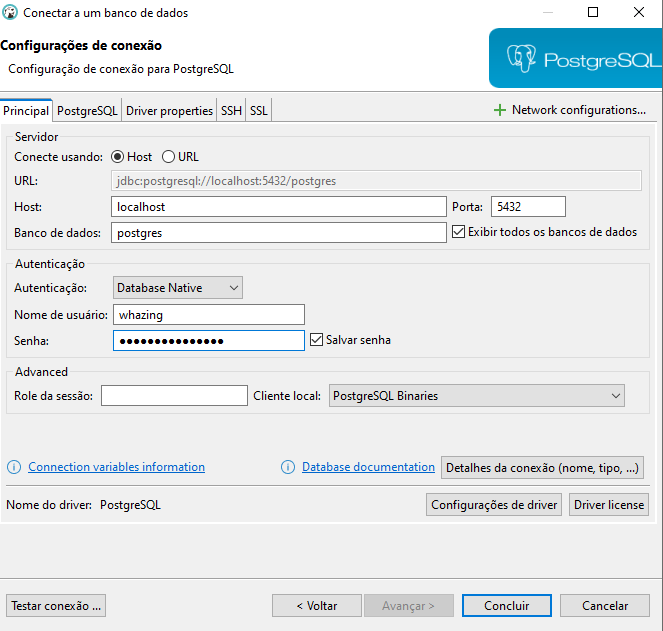
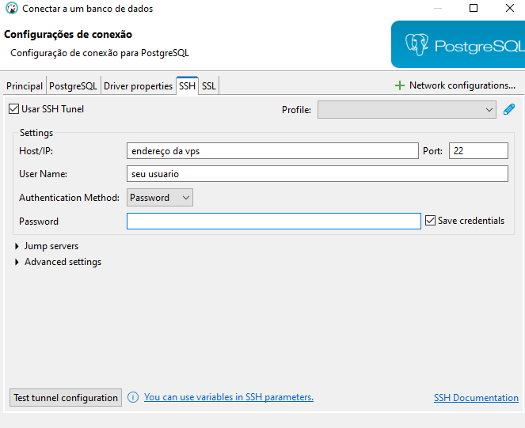

## Como Conectar ao Banco de dados Postgres SQL

programa para acessar Banco de Dandos Postgres SQL
DBeaver

```bash
https://dbeaver.io/download/
```

## Cria um Postgres SQL
Clique em nova conexão, escolha postgresql

host = Ip da VPS

porta 

```bash
5432
```
## ativar 
Exibir todos os bacos de dados


## banco de dados

```bash
postgres
```
Nome do usuários

```bash
whazing
```

## Senha Banco de dados Criada por padrão

```bash
AKwWM4Qu2GRppJ7
```


>

Na aba ssh marcar opcao "usar ssh tunel" e preencher dados da vps

>
