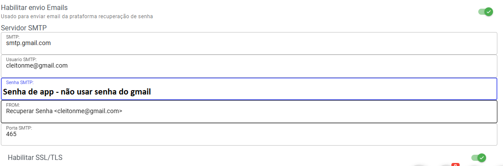

## Como Configurar gmail lembrar senha

Você tem que usar senha de app no site abaixo ensina como obter

```bash
https://support.google.com/accounts/answer/185833?hl=pt-BR
```

## Configuração no Whazing
Smtp

```bash
smtp.gmail.com
```

Usuario Smtp

```bash
seuemail@gmail.com
```

Senha Smtp

```bash
Senha gerado usando instruções do link anuncio
```

From

```bash
Recuperar Senha <seuemail@gmail.com>
```

Porta SMTP

```bash
465
```

Habilitar SSL/TLS

Deixar ativado


>