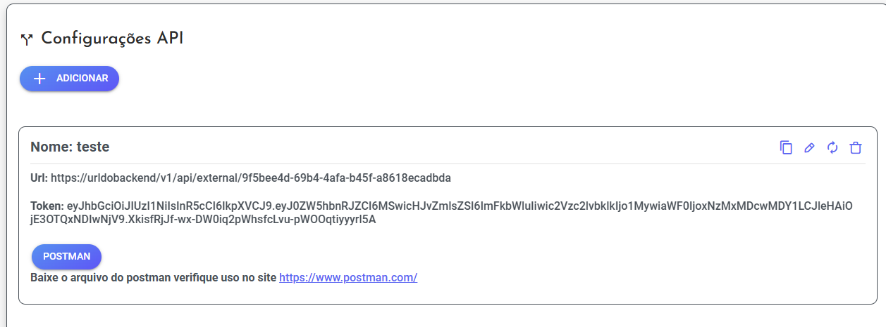
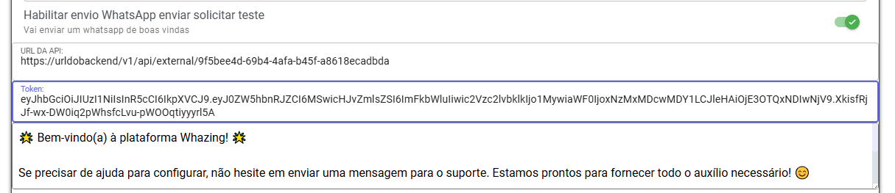

## Como Configurar Mensagem boas vindas teste

Ir até tela api criar uma configuração de API

```bash
https://urldoseufrontend/#/api-service
```

Da na tela empresa mensagem boas vindas so copiar dados exatamente como aparece tela api como exemplo abaixo


>

>

Variveis disponivel na mensagem


```bash
{{nomeempresa}}
```

```bash
{{nomeresponsavel}}
```

```bash
{{email}}
```

```bash
{{senha}}
```